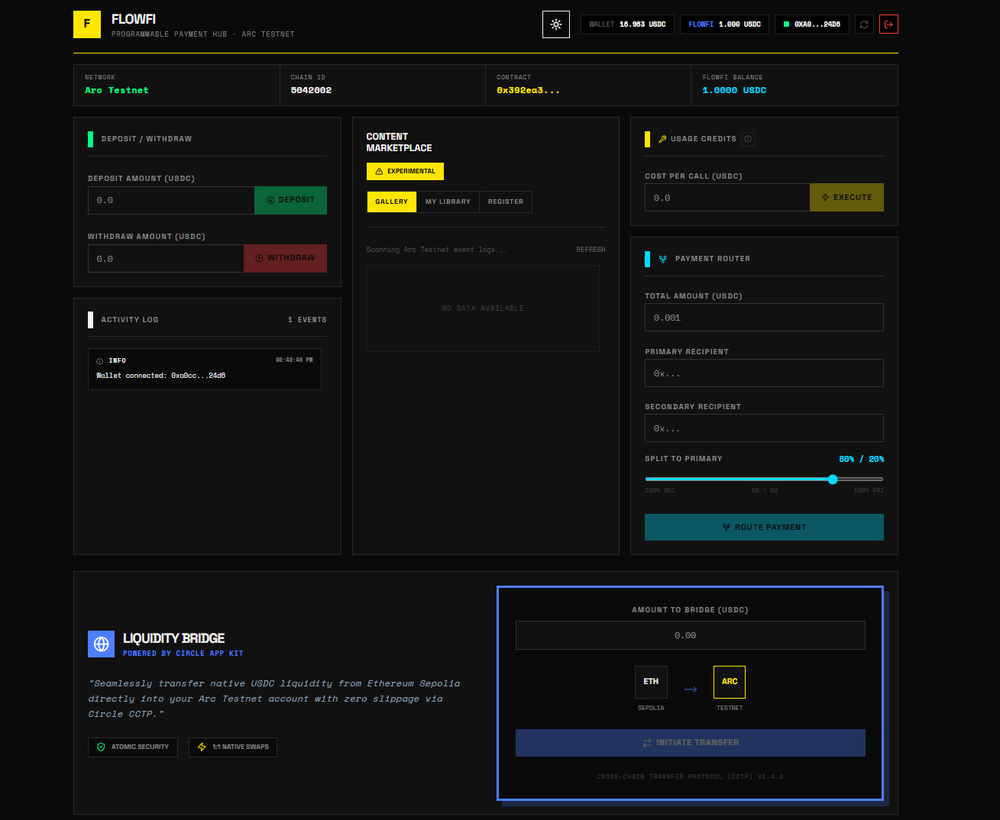

# FlowFi 🌊
### Decentralized Trust & Privacy Marketplace on Arc Network

**FlowFi** is a state-of-the-art Web3 platform designed to facilitate secure, encrypted, and trustless digital asset trading. It leverages the **Arc Testnet** for high-speed transactions and **Lit Protocol** for autonomous privacy gating.



---

## 🏆 Key Features & Architecture

### 1. 🛡️ Trustless Escrow & Economic Security
FlowFi eliminates "friendly fraud" through rigorous economic protocols:
- **24-Hour Dispute Window**: Payments are locked in escrow upon purchase. If a buyer receives a dead link or invalid payload, they can raise a dispute, freezing the funds.
- **Security Deposits**: Raising a dispute requires a 2 USDC deposit. This forces buyers to put "skin in the game," eliminating spam reports.
- **Creator Staking**: Content creators must stake a minimum of 5 USDC collateral in the protocol. Verified status prevents low-quality spam rings. Collateral is slashable in cases of verified fraud.

### 2. 🤫 Mathematical Privacy (Lit Protocol)
Data is not just token-gated; it is cryptographically locked:
- **Client-Side Encryption**: Secrets are encrypted locally in the browser before ever touching the network via the `@lit-protocol/lit-node-client`.
- **Autonomous Gating**: The encrypted ciphertext is hosted on IPFS. Decentralized Lit nodes will only decrypt the content if the requesting wallet holds the specific ERC-1155 Access NFT on the Arc Testnet.

### 3. 🛡️ Bulletproof Sync Engine
Most dApps rely on fragile RPC indexing that often breaks due to block limits. FlowFi implements an adaptive **RPC Fallback Scanner**:
- **Smart Range Scanning**: Dynamically pulls up to 9,500 blocks backward from the chain tip to prevent `413 Range Errors`.
- **Race Condition Shield**: Implements a 10-block buffer to handle out-of-sync RPC nodes.

### 4. 🎨 Refined Brutalist UX
A visual identity that matches the precision of the code:
- **Zero-Radius Design**: Stark, hard edges and thick borders for high-impact readability.
- **Dual-Theme Engine**: Sleek **Dark Mode** and high-contrast **Newsprint Light Mode**.
- **Real-Time Telemetry**: An Activity Log provides transparent system feedback on every node handshake and block scan.

---

## 🚀 Technical Stack

- **L1 Blockchain**: Arc Testnet (RPC: `rpc.testnet.arc.network`)
- **Privacy Engine**: Lit Protocol (`datil` network)
- **Frontend**: Next.js 15 (App Router), Tailwind CSS v4, Viem v2
- **Data Layer**: IPFS (via Pinata) for permissionless metadata storage
- **Design**: Refined Brutalism (Space Grotesk & Space Mono)

---

## 📅 Roadmap: Phase 3
- **Decentralized Juries**: Transitioning dispute resolution from a central admin to a community-voted Kleros-style architecture.
- **GenLayer AI Validators**: Integrating Off-chain AI agents to pre-validate URLs and resolve basic disputes autonomously without human intervention.

---

## 🛠️ Local Setup

### 1. Smart Contract
Ensure you have [Foundry](https://getfoundry.sh/) installed.
```bash
# Build contracts
forge build

# Test logic
forge test -vvv
```

### 2. Frontend
```bash
cd frontend

# Install dependencies
npm install

# Configure environment (.env.local)
NEXT_PUBLIC_CONTRACT_ADDRESS="0xaE933dE72586F4dA6be93C64D99fB702d3a34200"
PINATA_JWT="your_pinata_jwt"

# Run development server
npm run dev
```

---

## 📡 Deployment Data

- **Chain ID**: `5042002` (Arc Testnet)
- **Contract Address**: `0xaE933dE72586F4dA6be93C64D99fB702d3a34200`
- **Explorer**: [testnet.arcscan.app](https://testnet.arcscan.app)

---

## 📜 License

MIT © 2026 FlowFi Team
